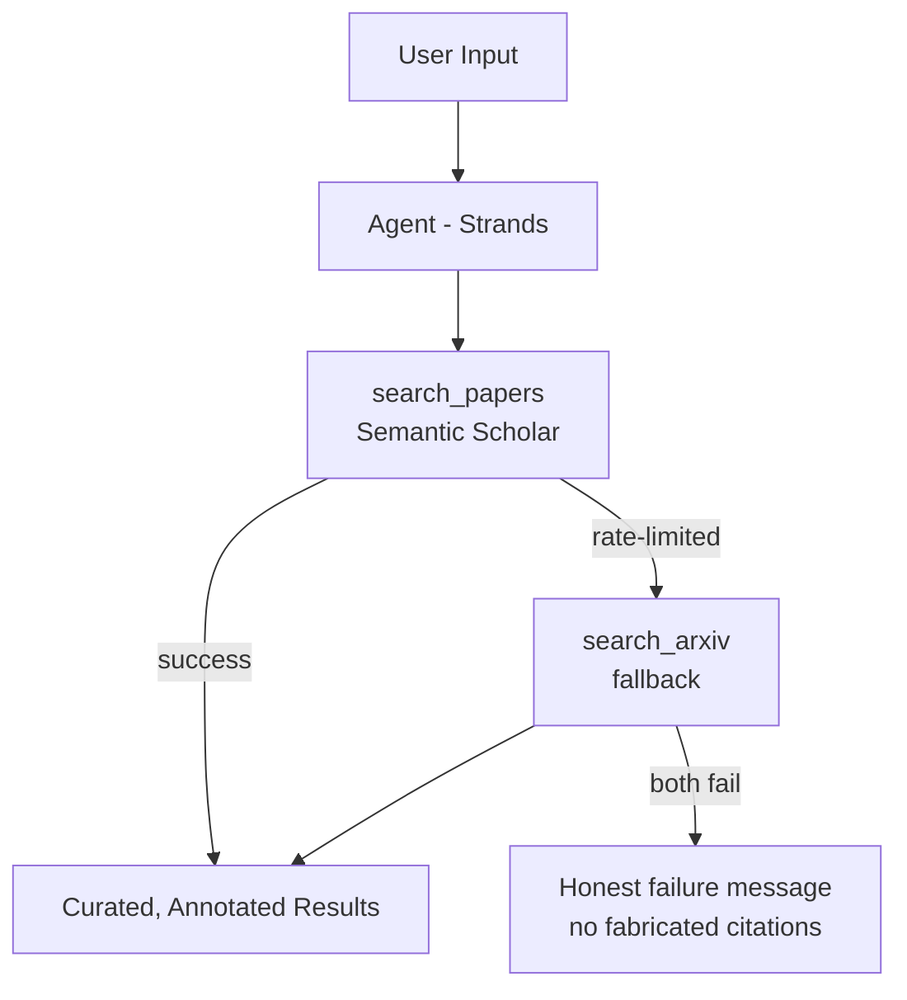

# Paper Finder Agent

An AI agent built with [Strands Agents](https://strandsagents.com) that finds 
relevant research papers based on a topic, call-for-abstracts theme, or your 
personal research angle.

## What it does

Describe your research context — a topic, a call for abstracts, or your 
specific angle on a subject — and the agent breaks it into focused search 
queries, searches Semantic Scholar (with arXiv as an automatic fallback if 
rate-limited), and returns a curated, annotated reading list with notes on 
why each paper is relevant.

If both search sources are unavailable, the agent tells you honestly rather 
than inventing citations from memory.

## How to run

1. Clone the repo and install dependencies:
```bash
pip install -r requirements.txt
```

2. Copy `.env.example` to `.env` and fill in any required keys:
```bash
cp .env.example .env
```

3. Run the agent:
```bash
python -u paper_finder_agent.py
```

4. When prompted, describe your research context, e.g.:
> "Call for abstracts on sustainable infrastructure in coastal cities; my angle is steel sheet pile corrosion from wave action."

## Architecture




## Tech stack

- [Strands Agents](https://strandsagents.com) framework
- Semantic Scholar API
- arXiv API
- Python

## License

MIT

## Known limitations

- **Rate limits:** Semantic Scholar's public API is unauthenticated and 
  shares a global rate limit pool, so searches can occasionally fail during 
  busy periods. The agent falls back to arXiv automatically, but if both 
  sources are rate-limited, it will tell you plainly rather than fabricating 
  citations from memory.
- **Coverage:** arXiv only indexes preprints in physics, math, CS, and a few 
  adjacent fields — for niche or non-STEM topics, Semantic Scholar coverage 
  matters more, so results may be sparser when it's unavailable.
- **No API key by default:** without a Semantic Scholar API key, you're 
  sharing the public rate limit pool with all unauthenticated users, so 
  reliability improves noticeably if you add one (see `.env.example`).

  